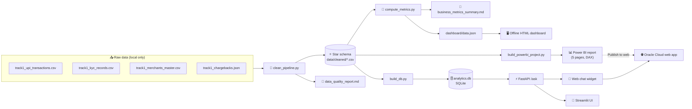
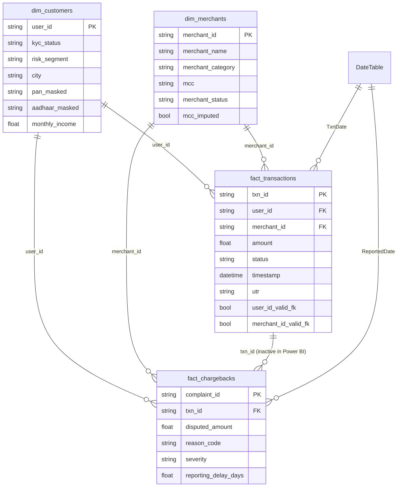
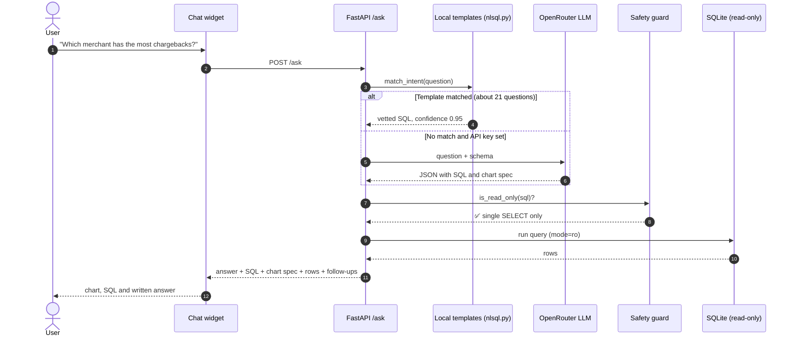
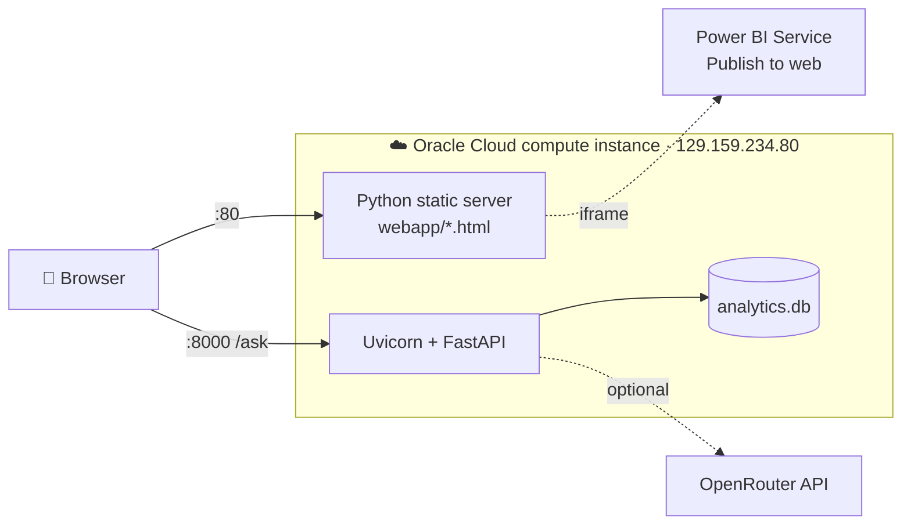

<div align="center">

# 🛡️ UPI Fraud Ring & Merchant Risk Analytics

### From messy payment logs to a live dashboard and a chatbot that answers in plain English

**TransOrg AgentIQ Datathon · Track 1 (FinTech & BFSI) · Team *The Clove Mix***

<br/>

[](http://129.159.234.80/index.html)
[](https://app.powerbi.com/view?r=eyJrIjoiMTI5ZGU2MzMtM2FhYS00NDZlLWJkNmYtOTJmOGVhMWExMjUzIiwidCI6ImUxNGU3M2ViLTUyNTEtNDM4OC04ZDY3LThmOWYyZTJkNWE0NiIsImMiOjEwfQ%3D%3D)
[](#-presentation--video-walkthrough)
[](#-presentation--video-walkthrough)

<br/>


</div>

---

## 👋 In short

UPI moves a staggering amount of money every day, and fraud rarely shows up as one obvious bad transaction. It hides in the gaps: users with no KYC record, merchants who get more disputes than they have transactions, and complaints filed weeks after the money left.

We were given four deliberately messy synthetic files (transactions, KYC records, a merchant master and a chargeback log) and asked to make sense of them. Here's what we built:

1. **A cleaning pipeline** that turns the raw files into a clean star schema. It never drops a messy row just because it's messy.
2. **A KPI engine** that calculates every business metric the brief asked for.
3. **Two dashboards**: a fully offline HTML dashboard, and a native Power BI report with five pages.
4. **A text-to-SQL chatbot** that answers questions like *"Which merchant has the highest chargeback count?"* It runs a real, read-only SQL query and shows you the chart, the SQL and a short written answer.
5. **A live deployment** on Oracle Cloud that puts the Power BI report and the chatbot on one web page.

> [!TIP]
> **Just want to see it?** Open the **[live app →](http://129.159.234.80/index.html)**, click the 💬 button in the corner and ask *"Show chargeback reason distribution."*

---

## 📑 Table of contents

<details open>
<summary><b>Click to expand / collapse</b></summary>

- [🎬 Presentation & video walkthrough](#-presentation--video-walkthrough)
- [🌐 Live deployment & platforms](#-live-deployment--platforms)
- [🏗️ Architecture at a glance](#️-architecture-at-a-glance)
- [🧹 Stage 1: Data cleaning](#-stage-1-data-cleaning)
- [⭐ Stage 2: Data modelling (star schema)](#-stage-2-data-modelling-star-schema)
- [📐 Stage 3: KPIs & business metrics](#-stage-3-kpis--business-metrics)
- [📊 Stage 4: Dashboards](#-stage-4-dashboards)
- [🤖 Stage 5: Building the chatbot](#-stage-5-building-the-chatbot)
- [🔍 Key findings](#-key-findings)
- [🗂️ Repository structure](#️-repository-structure)
- [⚙️ Run it yourself](#️-run-it-yourself)
- [☁️ Deploying to Oracle Cloud](#️-deploying-to-oracle-cloud)
- [👥 Team](#-team)

</details>

---

## 🎬 Presentation & video walkthrough

The slides tell the story of the project, and the video shows the dashboard and chatbot working live.

| | Resource | Link |
|:-:|---|---|
| 📊 | **Project presentation (PPT / PDF)** | [**View slides →**](https://docs.google.com/presentation/d/1WP0qyo0mvQjtOP2ksuNNZaxsXaJApUfbroSxadYwnlY/edit?usp=sharing) <!-- TODO: replace # with your Google Slides / OneDrive / PDF link --> |
| 🎥 | **Video explanation (full walkthrough)** | [**Watch video →**](#) <!-- TODO: replace # with your YouTube / Drive link --> |
| ⚡ | **Short demo (chatbot in action)** | [**Watch demo →**](#) <!-- TODO: optional, remove the row if not needed --> |

<!--
  To show a clickable video thumbnail, replace VIDEO_ID below with your YouTube ID and uncomment:

  <div align="center">
    <a href="https://youtu.be/VIDEO_ID">
      
    </a>
  </div>
-->

---

## 🌐 Live deployment & platforms

<div align="center">

### 👉 [http://129.159.234.80](http://129.159.234.80/index.html)


<sub>All links below were checked on 16 September 2026.</sub>

</div>

The live web app has four pages. They share a navigation bar, and the 💬 chat assistant is available on every page:

| Page | What you'll find | Link |
|---|---|---|
| 📈 **Dashboard** | The embedded Power BI report and the "Ask the data" chatbot | [Open ↗](http://129.159.234.80/index.html) |
| 🔀 **Workflow** | Five animated diagrams that follow the data from the raw files to the chatbot | [Open ↗](http://129.159.234.80/workflow.html) |
| 👥 **Team** | The five people behind the project | [Open ↗](http://129.159.234.80/team.html) |
| ℹ️ **Information** | Tips for reading the dashboard, the file structure and an FAQ | [Open ↗](http://129.159.234.80/information.html) |

<details>
<summary><b>🔀 Jump straight to a diagram on the Workflow page</b></summary>

<br/>

| Diagram | Link |
|---|---|
| Data cleaning: raw files to star schema | [workflow.html#cleaning](http://129.159.234.80/workflow.html#cleaning) |
| KPI integration: star schema to metrics | [workflow.html#kpi](http://129.159.234.80/workflow.html#kpi) |
| Dashboards & filters | [workflow.html#dashboards](http://129.159.234.80/workflow.html#dashboards) |
| End-to-end architecture | [workflow.html#architecture](http://129.159.234.80/workflow.html#architecture) |
| How the chatbot reads the data | [workflow.html#bot](http://129.159.234.80/workflow.html#bot) |

</details>

### Platforms used

| Platform | Role in the project | Link |
|---|---|---|
|  | A compute instance hosts the web app (port 80) and the FastAPI chatbot backend (port 8000) | [Live app](http://129.159.234.80/index.html) · [OCI](https://www.oracle.com/cloud/) |
|  | The report *UPI Transaction Anomaly & Risk Intelligence* is shared with *Publish to web* and embedded in the dashboard page | [Public report ↗](https://app.powerbi.com/view?r=eyJrIjoiMTI5ZGU2MzMtM2FhYS00NDZlLWJkNmYtOTJmOGVhMWExMjUzIiwidCI6ImUxNGU3M2ViLTUyNTEtNDM4OC04ZDY3LThmOWYyZTJkNWE0NiIsImMiOjEwfQ%3D%3D) |
|  | LLM gateway (`openai/gpt-4o-mini`) for questions the local templates don't cover. It's switched on in the live deployment. | [openrouter.ai](https://openrouter.ai) |
|  | Source code, cleaned data, reports and the Power BI project | [Repository ↗](https://github.com/Saurabh3719/Datathon) |

### Chatbot API

The live API is at **`http://129.159.234.80:8000`**. FastAPI generates interactive docs automatically, so you can try every endpoint from your browser:

<div align="center">

[](http://129.159.234.80:8000/docs)
[](http://129.159.234.80:8000/redoc)

</div>

| Method | Endpoint | Purpose |
|:-:|---|---|
| `POST` | `/ask` | Send `{"question": "..."}` and get back the SQL, the rows, a chart spec and a written answer. It only accepts POST, so use the chat widget, Swagger or curl. |
| `GET` | [`/health`](http://129.159.234.80:8000/health) | Health check (drives the green "agent online" dot in the navigation bar) |
| `GET` | [`/examples`](http://129.159.234.80:8000/examples) | The list of supported example questions |
| `GET` | [`/openapi.json`](http://129.159.234.80:8000/openapi.json) | The machine-readable API schema |

```bash
curl -s -X POST http://129.159.234.80:8000/ask \
  -H "Content-Type: application/json" \
  -d '{"question": "Which merchant has the highest chargeback count?"}'
# → "Mukhopadhyay, Dua and Dada (MCH9291) has the highest chargeback count, with 42 disputes."
```

> [!NOTE]
> The site runs on a single cloud VM over plain HTTP, so use the exact page links above. Short paths such as `/team` return a 404, so include `.html`. If the VM is restarting, the Power BI report link still works on its own.

---

## 🏗️ Architecture at a glance

The project has one cleaning pipeline and three consumers. The HTML dashboard, the Power BI report and the chatbot all read the **same cleaned CSVs**, so every number matches wherever you see it.



---

## 🧹 Stage 1: Data cleaning

> **Our rule:** *never silently drop a messy row.* We standardize it, and if a raw value can't be trusted we add a boolean flag column. A row is removed only when it's an exact duplicate or its ID can't be recovered at all.

The evaluation notes say that dropping messy rows wholesale gets penalized. That rule also turned out to matter for the analysis: the "noise" we kept ended up being the dataset's biggest finding (see [Key findings](#-key-findings)).

### What was messy, and how we fixed it

<details>
<summary><b>🆔 Identifiers</b>: <code>USR12345</code>, <code>usr-12345</code>, <code>12345</code>, …</summary>

<br/>

We strip every non-digit character, then add the prefix back and zero-pad to a fixed width:

| Entity | Prefix | Digits | Example |
|---|---|---|---|
| Customer | `USR` | 5 | `USR16112` |
| Merchant | `MCH` | 4 | `MCH7045` |
| Transaction | `TXN` | 8 | `TXN00011869` |

</details>

<details>
<summary><b>💰 Amounts</b>: ₹ / Rs / INR prefixes, thousands separators, <code>k</code> / <code>l</code> suffixes, negative values</summary>

<br/>

- We strip the currency symbols and separators, and expand `k` (thousand) and `l` (lakh).
- Negative values have their sign corrected and are **flagged** (`amount_was_negative`, etc.), not dropped.
  - 420 transaction amounts, 220 disputed amounts, 1,208 monthly incomes and 349 average ticket sizes were negative.

</details>

<details>
<summary><b>🕐 Timestamps</b>: six or more formats in a single column</summary>

<br/>

Formats we found: Unix epoch (`1770063471`), ISO (`2026-01-15 00:11:30`), year-first slash (`2026/03/07`), day-first slash with 12h/24h time, `15-Sep-2025`, and month-first dash with AM/PM.

We parse them in a fixed order:

1. A bare 9–10 digit string is treated as epoch seconds.
2. `YYYY/MM/DD` is read year-first.
3. Any other string with `/` is read day-first. We confirmed this against values whose first number is greater than 12.
4. The remaining formats are handled explicitly.

</details>

<details>
<summary><b>🏷️ Categorical spellings</b>: status, KYC, city, merchant category, severity</summary>

<br/>

| Field | Before | After |
|---|---|---|
| Transaction status | `S`, `TXN_SUCCESS`, `COMPLETED`, `Declined`, `PROCESSING`… | `SUCCESS` / `FAILED` / `PENDING` |
| KYC status | `APPROVED`, `KYC_DONE`, `Under Review`, `R`… | `VERIFIED` / `PENDING` / `REJECTED` |
| City | `bombay`, `MUMBAI`, `mumbai` | `Mumbai` |
| Merchant category | 82 raw spellings | 10 canonical categories |
| Severity | `P1`–`P4`, `H`, `High` | `CRITICAL` / `HIGH` / `MEDIUM` / `LOW` |
| Chargeback reason | 33 free-text variants (*"charged twice"*, *"not done by me"*, *"ATO"*…) | 7 fraud categories |

The 7 reason categories are `DUPLICATE_DEBIT`, `UNAUTHORIZED_TRANSACTION`, `ACCOUNT_TAKEOVER`, `FRAUD_SUSPECTED`, `SERVICE_NOT_DELIVERED`, `AMOUNT_MISMATCH` and `GENERAL_DISPUTE`. The original text is kept in `reason_code_raw`.

</details>

<details>
<summary><b>🔐 PAN / Aadhaar, MCC codes, UTR</b></summary>

<br/>

- **PAN** is checked against the pattern `AAAAA9999A` and **Aadhaar** against 12 digits. Both are **masked** in the published output to a fixed width (10 and 12 characters), even though the data is synthetic, because this repo is public.
- **MCC codes** come in bare, zero-padded, float, hyphenated and `misc` forms. We normalize them to a 4-digit string. 367 missing codes were filled with the most common MCC for that merchant's category and flagged `mcc_imputed`.
- **UTR** is valid only when it's exactly 10 digits after removing spaces and hyphens. 1,000 transactions have no UTR and are flagged `utr_missing`.

</details>

<details>
<summary><b>🔗 Duplicates & foreign keys</b></summary>

<br/>

- Duplicate customers were merged into one record, keeping the most complete one and breaking ties with the most recent signup date.
- Exact duplicate transactions were removed.
- Every fact table gets `*_valid_fk` flags instead of losing its unmatched rows.
- 108 chargebacks have **impossible timestamps** (reported before the transaction, or a bank response before the report). They're kept and counted, but left out of the delay average.

</details>

### Before → after

| Source file | Raw rows | Clean rows | What changed |
|---|--:|--:|---|
| `track1_kyc_records.csv` → `dim_customers` | 36,400 | **28,920** | 7,480 duplicates merged · 3,428 invalid PAN · 6,746 invalid Aadhaar flagged |
| `track1_merchants_master.csv` → `dim_merchants` | 6,210 | **4,343** | 1,867 duplicates merged · 367 MCCs imputed · 1,471 without a settlement account |
| `track1_upi_transactions.csv` → `fact_transactions` | 20,400 | **20,000** | 400 exact duplicates removed · 13,522 unknown users · 10,369 unknown merchants (kept and flagged) |
| `track1_chargebacks.json` → `fact_chargebacks` | 2,884 | **2,800** | 84 duplicate complaints · 108 impossible timestamps · 193 unknown transactions (flagged) |

📄 Every count is in [`reports/data_quality_report.md`](reports/data_quality_report.md), and every lookup table is in [`reports/cleaning_mapping_reference.md`](reports/cleaning_mapping_reference.md).

---

## ⭐ Stage 2: Data modelling (star schema)



**Why is the `txn_id` link inactive in Power BI?** Both fact tables already connect straight to the customer and merchant tables. An active link between the two fact tables would give Power BI two filter paths between the same tables, which it doesn't allow. The date columns (`TxnDate`, `ReportedDate`) are calculated in Power Query rather than DAX, so they work as a role-playing date dimension. We learned that the hard way after hitting a `PFE_TM_RELATIONSHIP_END_COLUMN_INVALID` error.

---

## 📐 Stage 3: KPIs & business metrics

[`scripts/compute_metrics.py`](scripts/compute_metrics.py) calculates every metric in the brief. The same measures are also written in DAX for Power BI.

<table>
<tr>
<td align="center"><h3>20,000</h3>Transactions</td>
<td align="center"><h3>₹24.98 Cr</h3>Total value (all statuses)</td>
<td align="center"><h3>68.14%</h3>Success rate</td>
<td align="center"><h3>2,800</h3>Chargebacks</td>
</tr>
<tr>
<td align="center"><h3>14.00%</h3>Chargeback-to-txn ratio (count)</td>
<td align="center"><h3>6.5 days</h3>Avg. dispute delay</td>
<td align="center"><h3>64.43%</h3>KYC completion</td>
<td align="center"><h3>32.4%</h3>Txns with a real KYC match</td>
</tr>
</table>

<details>
<summary><b>📋 Full KPI list, with why each one matters</b></summary>

<br/>

| Group | KPI | Value | Why it matters |
|---|---|--:|---|
| **Transactions** | Total amount (success only) | ₹17,08,44,515 | The money that actually moved |
| | Avg. transaction value | ₹12,488.63 | Typical ticket size |
| | Failed rate | 7.76% | An early warning for operational problems |
| | Pending rate | 24.09% | Nearly 1 in 4 transactions is stuck in limbo |
| | Missing UTR | 1,000 (5%) | A missing settlement reference is a fraud and reconciliation red flag |
| **Disputes** | Chargeback amount | ₹80,01,121 | Total money under dispute |
| | Chargeback-to-txn ratio (amount) | 3.20% | A low ratio by count can hide a few high-value disputes |
| | Disputes reported after 7+ days | 524 | Late reports can point to account takeover |
| **Risk** | Users with 2+ disputes | 125 | Repeat disputers |
| | High-risk merchants | 6 | Ratio in the top 10% among comparable merchants |
| | Chargebacks on unknown merchants | 1,501 (₹42.9 L) | Money disputed against merchants with no master record |
| | Merchant-days with 2+ transactions | 242 | Unusual clusters, given the normal pattern is about 1 transaction per merchant in 90 days |
| **KYC** | KYC rejection rate | 8.15% | How the KYC funnel is performing |
| **Data integrity** | Txn ↔ merchant match | 48.16% | Half the activity has no merchant on record |
| | Chargeback ↔ txn match | 93.11% | 6.9% of disputes have no matching transaction on file |

</details>

📄 Written summary: [`reports/business_metrics_summary.md`](reports/business_metrics_summary.md)

---

## 📊 Stage 4: Dashboards

We built two versions of the dashboard, each for a different situation.

<table>
<tr>
<th width="50%">🖥️ Offline HTML dashboard</th>
<th width="50%">📊 Power BI report</th>
</tr>
<tr valign="top">
<td>

- `dashboard/index.html`: **open it with a double-click.** No server and no internet needed.
- Chart.js and the data are bundled with the file.
- Includes the *Fraud-Ring Spotlight* section.

</td>
<td>

- `powerbi/UPI_Fraud_Analytics.pbip`: a native Power BI project, published as **UPI Transaction Anomaly & Risk Intelligence** generated from code as TMDL and JSON.
- Five pages (four analysis pages plus a KPI Reference page), 38 DAX measures and filter panels scoped to each page.
- Published to the web and embedded in the live app. [**Open the report ↗**](https://app.powerbi.com/view?r=eyJrIjoiMTI5ZGU2MzMtM2FhYS00NDZlLWJkNmYtOTJmOGVhMWExMjUzIiwidCI6ImUxNGU3M2ViLTUyNTEtNDM4OC04ZDY3LThmOWYyZTJkNWE0NiIsImMiOjEwfQ%3D%3D)

</td>
</tr>
</table>

<details>
<summary><b>📄 What's on each Power BI page?</b></summary>

<br/>

| Page | Headline cards | Visuals | Filters on the page |
|---|---|---|---|
| **1 · Overview** | Transactions, amount, success rate, chargebacks + ▲/▼ trend badges | Daily count, daily value, amount by category (drill down to merchant) | Status, *UTR problem?* |
| **2 · Fraud & Disputes** | CB amount, CB ratio, avg. delay, disputes after 7 days | Reason donut, severity donut, CB ratio by category, top merchants table | Delay bucket, valid timestamps, resolution status, channel |
| **3 · Customer Risk & Data Quality** | KYC completion and rejection, KYC and merchant match rates | KYC donut, transactions by state (drill down to city), users by chargebacks | KYC status, risk segment, customer dispute risk, spike day |
| **4 · Fraud-Ring Spotlight** | Pending, failed, avg. value, UTR issues, high-risk merchants, spike days | Top merchants by disputed amount, same-day spike table | Category, merchant status, merchant dispute risk, spike day |
| **5 · KPI Reference** | n/a | A dictionary of every KPI and what it means, plus FAQ references | n/a |

The **Date** and **Merchant Category** filters apply to every page.

The design uses a light theme with indigo `#6366F1` and cyan `#06B6D4` accents. Cards that show fraud exposure get a crimson "risk" border so they stand out at a glance.

📄 Full write-up: [`powerbi/README.md`](powerbi/README.md)

</details>

---

## 🤖 Stage 5: Building the chatbot

The brief suggested an optional AI agent. We built a **read-only text-to-SQL assistant** that has two layers.

### How a question gets answered



### Why we check templates first

A call to an LLM means a network round trip, an API key and a small cost every time. It also can't promise the same SQL twice. The **~21 templates** we wrote and checked by hand cover every example question in the brief. They're **free, instant and give the same answer every time.** The LLM is only called for questions the templates don't cover.

### How we built it, step by step

<details>
<summary><b>1️⃣ Build the database</b> (<code>agent/build_db.py</code>)</summary>

<br/>

Loads the four cleaned CSVs into `agent/analytics.db` (SQLite). The script can be rerun any time the cleaned data changes.

</details>

<details>
<summary><b>2️⃣ Write the template engine</b> (<code>agent/nlsql.py</code>)</summary>

<br/>

- Matches phrases and substrings, so *"most disputes merchant"* works as well as the exact wording.
- Every template uses explicit `JOIN … ON` with aliases, and `DATE(timestamp)` for grouping by day in SQLite.
- The confidence score follows fixed rules rather than a fake probability: **0.95** when a template matches, **0.5** when the question is ambiguous and **0.0** when nothing matches.
- **Ambiguity check:** a bare "amount" could mean transaction amount or disputed amount, so the bot asks which one you mean instead of guessing.

</details>

<details>
<summary><b>3️⃣ Add the LLM fallback</b> (<code>agent/openrouter_client.py</code>)</summary>

<br/>

Each fallback question makes two calls:

1. `plan_with_llm()` sends the question and the schema, and asks for **JSON only**: intent, SQL, chart spec and the table relationships used.
2. `summarize_with_llm()` writes the final answer **from the real result rows**, so the numbers it quotes come from the data.

It's off by default and turns on when `OPENROUTER_API_KEY` is set. An earlier version called Gemini directly before we moved to OpenRouter.

</details>

<details>
<summary><b>4️⃣ Lock it down</b> (<code>agent/safety.py</code>)</summary>

<br/>

There are two layers of protection, and **both apply to template SQL and LLM SQL alike**:

- **A regex guard** that only allows a single `SELECT` (or `WITH … SELECT`). It blocks `INSERT`, `UPDATE`, `DELETE`, `DROP`, `ALTER`, `ATTACH`, `PRAGMA` and similar statements, and rejects multiple statements separated by `;`.
- **A read-only connection**: SQLite is opened with `mode=ro`.

</details>

<details>
<summary><b>5️⃣ Build the interfaces</b> (<code>agent/app.py</code>, <code>agent/frontend.py</code>, <code>webapp/</code>)</summary>

<br/>

- **FastAPI** provides the `/ask`, `/health` and `/examples` endpoints, with CORS enabled for the web page.
- **Streamlit** shows the chart, the SQL, a collapsible answer and a sidebar of follow-up questions.
- **The web chat widget** (`chat-widget.js`) floats on every page of the live app and draws its charts with Chart.js.

</details>

<details>
<summary><b>📦 Example response</b></summary>

<br/>

```json
{
  "llm_context_extraction": {
    "intent": "rank_merchants_by_chargeback_count",
    "keywords_matched": ["chargeback", "merchant"],
    "confidence_score": 0.95,
    "source": "template",
    "model": null
  },
  "collapsible_suggested_answer": {
    "title": "Click to view detailed answer summary",
    "answer_summary": "Mukhopadhyay, Dua and Dada (MCH9291) has the highest chargeback count, with 42 disputes."
  },
  "er_relationship_mapping": {
    "primary_table": "fact_chargebacks",
    "joined_tables": ["dim_merchants"],
    "join_conditions": ["fact_chargebacks.merchant_id = dim_merchants.merchant_id"]
  },
  "sql_query": "SELECT ...",
  "visualization": { "type": "bar", "x_axis": "merchant_name", "y_axis": "chargeback_count" },
  "index_space_followups": ["...", "..."],
  "rows": [ { "...": "..." } ]
}
```

</details>

<details>
<summary><b>💬 Questions you can ask</b></summary>

<br/>

| Transactions | Disputes & risk |
|---|---|
| Show daily transaction volume trend | Which merchant has the highest chargeback count? |
| Show total transaction amount by merchant category | Which merchant category has the highest disputed amount? |
| Compare successful vs failed transactions by day | Show chargeback reason distribution |
| Show average transaction value trend over time | Show top 10 users by disputed amount |
| Which KYC status has the highest transaction amount? | Compare chargebacks by severity level |
| Transactions missing UTR or with invalid UTR formats | Show disputes reported after 7 days |
| Pending transaction rate | Which merchant has the highest chargeback-to-transaction ratio? |
| Failed transaction rate | High-risk merchants / users with repeated disputes |
| Average transaction value | Merchants with sudden transaction spikes |

</details>

### ✅ Checking the answers

We ran every template and compared its output with the pandas-generated metrics report, which was produced separately. **They match exactly**, for example:

- Most chargebacks: **MCH9291**, 42 disputes
- Highest chargeback-to-transaction ratio: **MCH8779**, 566.7%
- Failed rate: **7.8%** · Pending rate: **24.1%** · Average transaction value: **₹12,488.63**

---

## 🔍 Key findings

> [!IMPORTANT]
> **The biggest signal in this dataset comes from the joins between tables, not from any single chart.**

- 🔗 **Only 32.4%** of transactions belong to a user who exists in the KYC master, and **only 48.2%** to a merchant in the merchant master. That's far too many to be typos. Most of the platform's activity **can't be traced to a known identity or merchant**, which fits the "fraud ring" theme of the dataset.
- 🚩 **Disputes far out of proportion to transactions:** one merchant has **42 disputes against just 3 recorded transactions**, and one user has **14 disputes with no KYC record at all**.
- ⏳ **524 disputes were reported 7 or more days late**, a common sign of account takeover or fraud caught late.
- 📍 **242 merchant-days show same-day transaction spikes.** 8 disputes across 4 merchants followed a spike within 10 days.
- 💸 **1,501 chargebacks worth ₹42.9 L** point to merchants with no master record.

If we had analysed only the matched rows, we'd have understated the risk. If we had dropped the unmatched rows, the most important finding would have disappeared.

---

## 🗂️ Repository structure

<details>
<summary><b>Click to view the file tree</b></summary>

```text
Datathon/
├── data/
│   ├── raw/                         # not published (contains unmasked PAN/Aadhaar)
│   └── cleaned/                     # ⭐ star schema: the single source of truth
│       ├── dim_customers.csv
│       ├── dim_merchants.csv
│       ├── fact_transactions.csv
│       └── fact_chargebacks.csv
├── scripts/
│   ├── clean_pipeline.py            # raw → cleaned star schema
│   ├── compute_metrics.py           # cleaned → reports + dashboard/data.json
│   ├── build_dashboard.py           # data.json + template → dashboard/index.html
│   └── build_powerbi_project.py     # cleaned → native Power BI project
├── reports/
│   ├── data_quality_report.md       # every cleaning count, and the reasons
│   ├── business_metrics_summary.md  # every KPI, with commentary
│   └── cleaning_mapping_reference.md# every lookup table, for auditing
├── dashboard/                       # offline HTML dashboard (Chart.js bundled)
├── powerbi/                         # UPI_Fraud_Analytics.pbip + TMDL semantic model
├── agent/
│   ├── build_db.py                  # CSV → SQLite
│   ├── nlsql.py                     # template text-to-SQL engine
│   ├── openrouter_client.py         # LLM fallback
│   ├── safety.py                    # read-only SQL guard
│   ├── app.py                       # FastAPI backend
│   └── frontend.py                  # Streamlit UI
├── webapp/                          # deployed site: dashboard, workflow, team, info
│   ├── index.html · workflow.html · team.html · information.html
│   └── chat-widget.js/.css · nav-bar.js/.css · chart.umd.min.js
├── DEPLOY.md                        # Oracle Cloud deployment guide
├── requirements.txt
└── .env.example
```

</details>

---

## ⚙️ Run it yourself

> [!NOTE]
> The raw source files aren't in this repo because the KYC file contains unmasked PAN and Aadhaar values. To rerun the cleaning step, put the four original files in `data/raw/`. **The dashboards and the chatbot work straight from `data/cleaned/`, so you don't need the raw files to use them.**

```bash
# 1. Set up
git clone https://github.com/Saurabh3719/Datathon.git && cd Datathon
python3 -m venv .venv && source .venv/bin/activate
pip install -r requirements.txt

# 2. Pipeline (skip the first line if you don't have the raw files)
python3 scripts/clean_pipeline.py          # → data/cleaned/ + data quality report
python3 scripts/compute_metrics.py         # → metrics report + dashboard/data.json
python3 scripts/build_dashboard.py         # → dashboard/index.html
python3 scripts/build_powerbi_project.py   # → powerbi/
python3 agent/build_db.py                  # → agent/analytics.db

# 3. Chatbot
python3 -m uvicorn agent.app:app --port 8000
python3 -m streamlit run agent/frontend.py # in a second terminal
```

<details>
<summary><b>🔑 Optional: turn on the LLM fallback</b></summary>

```bash
cp .env.example .env
# edit .env → OPENROUTER_API_KEY=<key from https://openrouter.ai/keys>
# optional  → OPENROUTER_MODEL=openai/gpt-4o-mini
```

Restart uvicorn afterwards. The `source` field in each response tells you which layer answered: `template` or `openrouter`.

</details>

<details>
<summary><b>🧪 Test the API with curl</b></summary>

```bash
curl -s -X POST http://localhost:8000/ask \
  -H "Content-Type: application/json" \
  -d '{"question": "Which merchant has the highest chargeback count?"}'
```

</details>

---

## ☁️ Deploying to Oracle Cloud

This is how the [live app](http://129.159.234.80/index.html) was set up. The full guide is in [`DEPLOY.md`](DEPLOY.md).



1. Copy the `agent/` folder and `data/cleaned/` to the instance, for example into `/opt/upi-analytics/` (the path the live instance uses).
2. Install Python 3.10+, run `pip install -r requirements.txt`, then run `python3 agent/build_db.py`.
3. Add `OPENROUTER_API_KEY` to `.env`. This is optional, but the live instance has it set, so questions outside the templates still get answered.
4. Start the API on all network interfaces:
   ```bash
   python3 -m uvicorn agent.app:app --host 0.0.0.0 --port 8000
   ```
5. Open **ports 80 and 8000** in the OCI security list and in the operating system's firewall.
6. Serve `webapp/` on port 80. The live instance uses Python's built-in static server:
   ```bash
   cd webapp && sudo python3 -m http.server 80
   ```
   The chat widget finds the API automatically at `http://<same-host>:8000`.
7. In Power BI Desktop, publish the report, then choose **File → Embed report → Publish to web**. Paste the link into `POWERBI_EMBED_URL` in `webapp/index.html`.

> [!WARNING]
> The API has no authentication, only the read-only guard. For real production use, put it behind nginx or Caddy with TLS and a proper domain.

---

## 👥 Team

<div align="center">

**The Clove Mix**: five M.Tech engineers, one datathon and a lot of chai breaks.

<table>
<tr>
<td align="center" width="20%"><h1>😎</h1><b>Manu Dev Chhiller</b><br/><sub><i>Mr. Jatt</i></sub><br/><sub>M.Tech, Data Science</sub><br/><sub><i>"Big energy, bigger commits."</i></sub></td>
<td align="center" width="20%"><h1>🏔</h1><b>Saurabh Tariyal</b><br/><sub><i>Desi Nepali Saurav</i></sub><br/><sub>M.Tech, Data Science</sub><br/><sub><i>"Compiles code and chai in equal measure."</i></sub></td>
<td align="center" width="20%"><h1>⚡</h1><b>Gurupratap Singh Rathore</b><br/><sub><i>Guru Generate</i></sub><br/><sub>M.Tech, AI</sub><br/><sub><i>"Generating wisdom since npm install."</i></sub></td>
<td align="center" width="20%"><h1>📜</h1><b>Abhishek Mondal</b><br/><sub><i>The Ancient Piece</i></sub><br/><sub>M.Tech, Data Science</sub><br/><sub><i>"Old-school wisdom, new-school code."</i></sub></td>
<td align="center" width="20%"><h1>🐺</h1><b>Pohap Singh Layal</b><br/><sub><i>The Himalayan Husky</i></sub><br/><sub>M.Tech, Data Science</sub><br/><sub><i>"Fetching bugs, not sticks."</i></sub></td>
</tr>
</table>

<sub>School of Computing and AI</sub>

Meet the team properly on the **[Team page →](http://129.159.234.80/team.html)**

</div>

---

<div align="center">

**Built for the TransOrg AgentIQ Datathon**

*All data is synthetic. PAN and Aadhaar values are masked in every published file.*

⭐ If this project helped you, consider giving the repo a star!

[⬆ Back to top](#️-upi-fraud-ring--merchant-risk-analytics)

</div>
